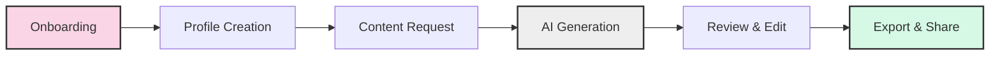

# AI Edit: Content Creation Reimagined

<div align="center">


_Transform your content creation workflow with AI-powered video generation_

[](https://reactnative.dev/)
[](https://expo.dev/)
[](https://supabase.io/)
[](LICENSE)

</div>

## ✨ Overview

AI Edit combines cutting-edge AI technology with intuitive design to revolutionize content creation. Our platform allows creators to generate professional-quality videos with personalized voice-overs, scripts, and visual styles - all powered by state-of-the-art AI.

<div align="center">
  
</div>

## 🚀 Key Features

- **AI Video Generation**: Turn text prompts into fully-rendered videos in minutes
- **Voice Cloning**: Create a personalized AI voice that sounds just like you
- **Smart Script Generation**: Generate and optimize content with GPT-4
- **Editorial Profiles**: Save your style preferences for consistent content
- **Seamless Onboarding**: Personalized setup with multi-language support
- **Analytics Dashboard**: Track your content performance and audience engagement

## 🎯 Recent Updates

### 🔄 Enhanced Onboarding Experience

- **Guided Setup**: Step-by-step personalized onboarding process
- **Voice Recording**: Create your AI voice clone in minutes
- **Style Questionnaire**: Customize your content style through a simple survey
- **AI Profile Generation**: Automatically create your editorial profile
- **User Control**: Fixed auto-advancing screens for better navigation
- **French Localization**: Full support for French-speaking users

### 🛠️ Technical Improvements

- **Database Schema**: Fixed survey data schema to properly handle UUID references
- **Error Handling**: Improved robustness for edge cases and network issues
- **Performance**: Optimized audio processing and database operations
- **Documentation**: Expanded developer documentation in memory-bank

### 📅 Coming Soon

- **Subscription Management**: RevenueCat integration for flexible payment options
- **Advanced Analytics**: Deeper insights into content performance
- **Template Library**: Expanded collection of video templates and styles
- **Collaboration Tools**: Team workflows for content approval

## 💻 Tech Stack

<div align="center">
  <table>
    <tr>
      <td align="center" width="33%">
        <b>Frontend</b><br>
        • React Native (Expo)<br>
        • Expo Router<br>
        • TypeScript<br>
        • TailwindCSS<br>
      </td>
      <td align="center" width="33%">
        <b>Backend</b><br>
        • Supabase<br>
        • Edge Functions<br>
        • PostgreSQL<br>
        • REST APIs<br>
      </td>
      <td align="center" width="33%">
        <b>AI Services</b><br>
        • OpenAI GPT-4<br>
        • ElevenLabs<br>
        • Creatomate<br>
        • Custom ML Models<br>
      </td>
    </tr>
  </table>
</div>

## 🏗️ Architecture

### User Journey



### Onboarding Flow

1. **Welcome Screen**: Introduction to the app capabilities
2. **Survey**: Understanding user content needs and style preferences
3. **Voice Recording**: Capturing voice samples for AI cloning
4. **Processing**: Generating editorial profile and voice clone
5. **Profile Review**: Customizing AI-generated editorial profile
6. **Features Showcase**: Highlighting premium capabilities
7. **Trial Offer**: Free trial period explanation
8. **Subscription Options**: Flexible payment plans
9. **Success & Tutorial**: Guided introduction to the main app

### Video Generation Pipeline

1. **Content Request**: User submits prompt, style, and voice preferences
2. **Script Generation**: AI creates optimized script based on user input
3. **Voice Synthesis**: Custom voice clone narrates the script
4. **Video Rendering**: Visual elements combined with narration
5. **Delivery**: Final video delivered to user's dashboard

## 🛠️ Development

### Prerequisites

- Node.js 18+
- Expo CLI
- Supabase CLI (for local development)

### Installation

1. Clone the repository:

```bash
git clone https://github.com/yourusername/ai-edit.git
cd ai-edit
```

2. Install dependencies:

```bash
npm install
```

3. Configure environment variables:

```bash
cp .env.example .env
# Edit .env with your API keys
```

4. Start the development server:

```bash
npm run dev
```

## 📚 Project Structure

```
├── app/                    # Expo Router app directory
│   ├── (auth)/            # Authentication routes
│   ├── (onboarding)/      # Onboarding flow
│   ├── (tabs)/            # Main app tabs
│   └── api/               # API routes
├── components/            # Reusable components
│   ├── onboarding/       # Onboarding-specific components
│   └── providers/        # Context providers
├── memory-bank/          # Project documentation
├── docs/                  # Documentation files
├── lib/                   # Core libraries
│   ├── agents/           # AI agent implementations
│   └── supabase.ts       # Supabase client
└── supabase/             # Supabase configuration
    ├── functions/        # Edge Functions
    └── migrations/       # Database migrations
```

## 🧩 Core Components

- **OnboardingProvider**: Manages the onboarding flow state
- **EditorialProfileForm**: UI for profile customization
- **VoiceRecordingScreen**: Audio capture with visualization
- **VideoRequestForm**: Content generation request interface
- **ScriptEditor**: AI-assisted script editing tool
- **SubscriptionManager**: Payment plan selection and management

## 🤝 Contributing

We welcome contributions to AI Edit! Please follow these steps:

1. Fork the repository
2. Create a feature branch (`git checkout -b feature/amazing-feature`)
3. Commit your changes (`git commit -m 'Add some amazing feature'`)
4. Push to the branch (`git push origin feature/amazing-feature`)
5. Open a Pull Request

## 📄 License

This project is licensed under the MIT License - see the [LICENSE](LICENSE) file for details.

## 🙏 Acknowledgements

- [OpenAI](https://openai.com/) for GPT-4 API
- [ElevenLabs](https://elevenlabs.io/) for voice synthesis technology
- [Creatomate](https://creatomate.com/) for video rendering capabilities
- [Supabase](https://supabase.io/) for backend infrastructure

---

<div align="center">
  <p>Built with ❤️ by the AI Edit Team</p>
  <p>
    <a href="https://twitter.com/aiedit">Twitter</a> •
    <a href="https://discord.gg/aiedit">Discord</a> •
    <a href="https://aiedit.io">Website</a>
  </p>
</div>
