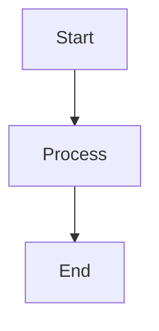

# AI Edit Documentation

This directory contains the official documentation for the AI Edit platform. The documentation is structured to provide clear, modular information about the platform's architecture, components, APIs, and development practices.

## Documentation Structure

- **[Architecture](./architecture/)**: System design, data flow, and integration points
- **[Components](./components/)**: Reusable UI components and their usage
- **[Guides](./guides/)**: How-to guides for common tasks
- **[API](./api/)**: API endpoints and usage
- **[Development](./development/)**: Development workflow and practices

## Documentation Levels

The AI Edit project uses a three-tier documentation approach:

1. **README.md**: High-level overview of the project, designed for first-time visitors
2. **Documentation (here)**: Detailed technical information for developers working on the project
3. **Memory Bank**: In-depth implementation details, decisions, and technical notes

Each level serves a different purpose and audience:

| Level         | Purpose                  | Audience                 | Location       |
| ------------- | ------------------------ | ------------------------ | -------------- |
| README        | Project overview         | New users, stakeholders  | Project root   |
| Documentation | Technical details        | Developers, contributors | `/docs`        |
| Memory Bank   | Implementation specifics | Core developers          | `/memory-bank` |

## Contributing to Documentation

When contributing to the documentation, please follow these guidelines:

1. Keep content modular and focused on a single topic
2. Link between related sections to maintain coherence
3. Update relevant memory-bank files when making significant changes
4. Keep the documentation in sync with code changes

### Documentation Format

All documentation files should:

- Use Markdown format (`.md` extension)
- Include a clear title at the top (H1)
- Have a logical hierarchy of headings
- Include code examples where relevant
- Link to related documentation

### Creating New Documentation

To add new documentation:

1. Identify the appropriate section based on the content type
2. Create a new `.md` file with a descriptive name
3. Add links to the new file from relevant index files
4. Consider adding the file to the main index at `docs/index.md`

### Updating Existing Documentation

When updating documentation:

1. Ensure factual accuracy and technical correctness
2. Maintain consistent style and formatting
3. Update any related documentation that might be affected
4. Add links to memory-bank files where applicable

## Special Documentation

Some special documentation files should not be modified without specific coordination:

- **creatomate.md**: Integration documentation for Creatomate services
- External service documentation requiring vendor approval

## Mermaid Diagrams

This documentation supports Mermaid diagrams for visual representations. Use this format:



## Code Examples

Include code examples where helpful:

```typescript
// Example of using the OnboardingProvider
const { nextStep, previousStep } = useOnboarding();

// Navigate to the next step
nextStep();
```

## Documentation Build

The documentation is currently static Markdown files. To preview locally:

1. Use VS Code with Markdown preview
2. Use GitHub's preview when viewing files on GitHub

In the future, we may implement a documentation site generator.

## Questions and Support

If you have questions about the documentation or need help:

1. Check the [Memory Bank](../memory-bank/) for detailed implementation notes
2. Refer to the [Contributing Guidelines](./development/contributing.md)
3. Contact the documentation maintainers
