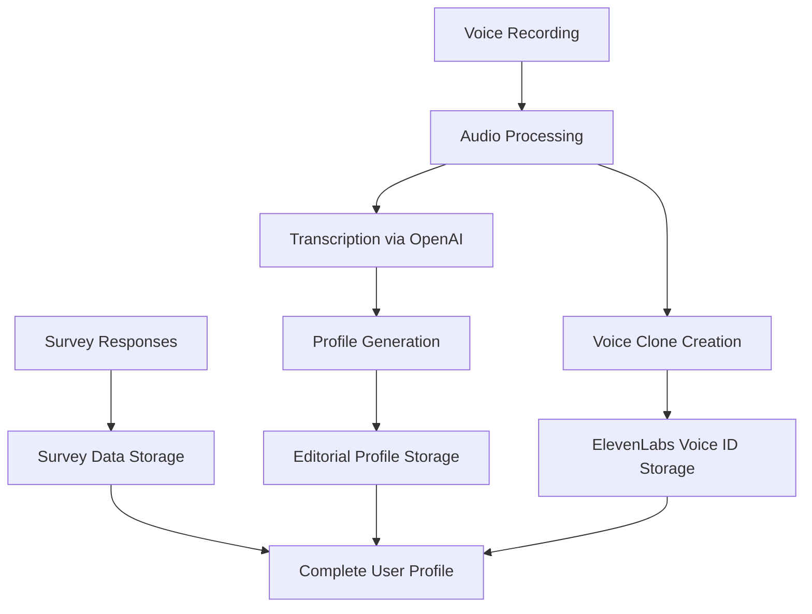

# Onboarding Flow Architecture

The AI Edit onboarding flow is designed to collect user preferences, create voice clones, and establish editorial profiles to personalize the content creation experience.

## Overview

The onboarding flow consists of several sequential steps that guide users through the setup process. As described in the [README](../../README.md#onboarding-flow), the complete flow includes:

1. **Welcome Screen**: Introduction to the app capabilities
2. **Survey**: Understanding user content needs and style preferences
3. **Voice Recording**: Capturing voice samples for AI cloning
4. **Processing**: Generating editorial profile and voice clone
5. **Profile Review**: Customizing AI-generated editorial profile
6. **Features Showcase**: Highlighting premium capabilities
7. **Trial Offer**: Free trial period explanation
8. **Subscription Options**: Flexible payment plans
9. **Success & Tutorial**: Guided introduction to the main app

## Component Architecture

The onboarding flow is managed by the `OnboardingProvider` context, which tracks the current step, completed steps, and user responses. For detailed component implementation, see [onboarding-component-architecture.md](../../memory-bank/onboarding-component-architecture.md) in the memory bank.

### Key Components

- **OnboardingProvider**: Central state management for the onboarding flow
- **ProgressBar**: Visual indicator of progress through the onboarding steps
- **VoiceRecordingScreen**: Handles audio capture and processing
- **ProcessingScreen**: Shows loading states during AI operations
- **EditorialProfileForm**: UI for reviewing and editing the AI-generated profile

## Data Flow

The onboarding flow involves several data processing steps:

For a detailed explanation of the data flow, see [onboarding-data-flow.md](../../memory-bank/onboarding-data-flow.md) in the memory bank.

## Database Integration

During onboarding, the following database tables are populated:

- `onboarding_survey`: Stores responses to the survey questions
- `editorial_profiles`: Stores the AI-generated and user-customized content style
- `voice_clones`: Stores references to the ElevenLabs voice clone

A recent fix addressed UUID handling in the `onboarding_survey` table. For details, see [onboarding-survey-db-fix.md](../../memory-bank/onboarding-survey-db-fix.md) in the memory bank.

## API Endpoints

The onboarding flow utilizes the following Supabase Edge Functions:

- `process-onboarding`: Handles voice recording processing, transcription, and profile generation
- `create-voice-clone`: Creates an ElevenLabs voice clone from the recorded audio

For implementation details, see [process-onboarding/index.ts](../../supabase/functions/process-onboarding/index.ts) and [create-voice-clone/index.ts](../../supabase/functions/create-voice-clone/index.ts).

## Auto-advance Behavior

A recent update (ONB-002) modified the onboarding flow to prevent screens from automatically advancing without user interaction. The following screens now require explicit user action to proceed:

- Features showcase
- Trial offer
- Subscription selection

For implementation details, see [onboarding-update-summary.md](../../memory-bank/onboarding-update-summary.md) in the memory bank.

## Error Handling

The onboarding flow includes robust error handling for:

- Network connectivity issues
- Audio recording permission denials
- Processing failures
- API response errors

Each error condition provides appropriate feedback and recovery options to ensure users can complete the onboarding process successfully.

## Localization

The onboarding flow supports multiple languages, with initial support for:

- English
- French

Text elements use a localization system to dynamically load the appropriate language based on device settings.

## Extending the Onboarding Flow

To add new steps to the onboarding flow:

1. Update the `ONBOARDING_STEPS` constant in the OnboardingProvider
2. Create a new screen component in the `(onboarding)` directory
3. Add any necessary API endpoints for data processing
4. Update the ProgressBar component to include the new step

For detailed guidance on extending the onboarding flow, see [Development Guidelines](../development/contributing.md).
