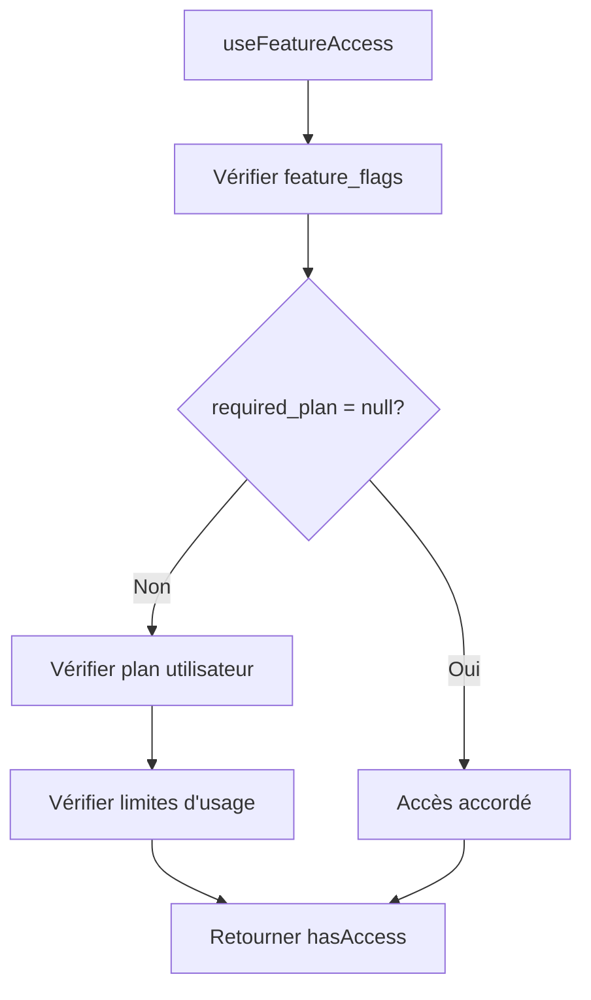

# Référence des Feature Flags - Editia

## 1. Vue d'ensemble

Ce document sert de référence complète pour le système de feature flags d'Editia. Il documente toutes les fonctionnalités, leur gating, et leur utilisation dans l'application.

## 2. Architecture du Système

### 2.1. Composants Principaux

- **Table `feature_flags`** : Configuration centralisée des fonctionnalités
- **Hook `useFeatureAccess`** : Logique de vérification d'accès
- **Composant `FeatureLock`** : UI de gating
- **Guard `AccountAnalysisGuard`** : Guard de niveau layout

### 2.2. Flux de Vérification



## 3. Configuration des Feature Flags

### 3.1. Structure de la Table

```sql
CREATE TABLE feature_flags (
  id TEXT PRIMARY KEY,
  name TEXT NOT NULL,
  description TEXT,
  required_plan TEXT REFERENCES subscription_plans(id),
  is_active BOOLEAN DEFAULT true,
  created_at TIMESTAMPTZ DEFAULT NOW()
);
```

### 3.2. Valeurs de `required_plan`

- `null` : Accessible à tous les utilisateurs
- `'free'` : Accessible aux utilisateurs gratuits et plus
- `'creator'` : Accessible aux plans Creator et Pro
- `'pro'` : Accessible uniquement au plan Pro

## 4. Référence Complète des Fonctionnalités

### 4.1. Fonctionnalités Gratuites (Plan Découverte)

| ID                 | Nom               | Description                                | Plan Requis | Utilisation              |
| ------------------ | ----------------- | ------------------------------------------ | ----------- | ------------------------ |
| `account_analysis` | Analyse de Compte | Analyse approfondie de votre compte TikTok | `null`      | ✅ Tous les utilisateurs |
| `chat_ai`          | Chat IA Éditorial | Chat avec l'IA pour conseils éditoriaux    | `free`      | ✅ Tous les utilisateurs |

### 4.2. Fonctionnalités Plan Créateur (€29/mois)

| ID                   | Nom                      | Description                                   | Plan Requis | Limites         |
| -------------------- | ------------------------ | --------------------------------------------- | ----------- | --------------- |
| `script_generation`  | Génération de Scripts    | Générer des scripts personnalisés avec IA     | `creator`   | Illimité        |
| `video_generation`   | Génération de Vidéos     | Générer des vidéos automatiquement avec IA    | `creator`   | 15 vidéos/mois  |
| `source_videos`      | Upload de Vidéos Sources | Uploader des vidéos B-roll pour vos créations | `creator`   | 50 vidéos       |
| `advanced_subtitles` | Sous-titres Avancés      | Styles de sous-titres personnalisés           | `creator`   | Tous les styles |

### 4.3. Fonctionnalités Plan Pro (€79/mois)

| ID                | Nom                          | Description                                         | Plan Requis | Limites        |
| ----------------- | ---------------------------- | --------------------------------------------------- | ----------- | -------------- |
| `voice_clone`     | Clonage Vocal                | Créer un clone de votre voix pour la narration      | `pro`       | 2 voix         |
| `multiple_voices` | Voix Multiples               | Gérer plusieurs voix clonées                        | `pro`       | Jusqu'à 3 voix |
| `niche_analysis`  | Analyse de Niche/Compétition | Analyses concurrentielles et rapports hebdomadaires | `pro`       | Illimité       |
| `content_ideas`   | Idées de Contenu Proactives  | Notifications de tendances et suggestions           | `pro`       | Illimité       |
| `scheduling`      | Programmation de Contenu     | Connecter et programmer sur TikTok/YouTube          | `pro`       | Illimité       |

## 5. Utilisation dans le Code

### 5.1. Hook `useFeatureAccess`

```typescript
// Vérification d'accès à une fonctionnalité
const { hasAccess, isLoading, remainingUsage } =
  useFeatureAccess('video_generation');

if (isLoading) return <LoadingSpinner />;
if (!hasAccess) return <FeatureLock requiredPlan="creator" />;
return <VideoGenerationComponent />;
```

### 5.2. Composant `FeatureLock`

```typescript
// Gating d'une fonctionnalité
<FeatureLock requiredPlan="creator" onLockPress={presentPaywall}>
  <VideoGenerationComponent />
</FeatureLock>
```

### 5.3. Guard de Layout

```typescript
// Guard au niveau layout
<AccountAnalysisGuard>
  <Slot />
</AccountAnalysisGuard>
```

## 6. Gestion des Limites d'Utilisation

### 6.1. Table `user_usage`

```sql
CREATE TABLE user_usage (
  user_id UUID PRIMARY KEY REFERENCES auth.users(id),
  current_plan_id TEXT REFERENCES subscription_plans(id),

  -- Compteurs de consommation
  videos_generated INT DEFAULT 0,
  source_videos_used INT DEFAULT 0,
  account_analysis_used INT DEFAULT 0,
  voice_clones_used INT DEFAULT 0,

  -- Limites actuelles
  videos_generated_limit INT,
  source_videos_limit INT,
  account_analysis_limit INT,
  voice_clones_limit INT,

  next_reset_date TIMESTAMPTZ,
  updated_at TIMESTAMPTZ DEFAULT NOW()
);
```

### 6.2. Calcul des Limites

Le hook `useFeatureAccess` calcule automatiquement les limites restantes :

```typescript
// Exemple pour video_generation
remaining = Math.max(
  0,
  userUsage.videos_generated_limit - userUsage.videos_generated
);
```

## 7. Stratégies de Gating

### 7.1. Gating Strict

```typescript
// Bloque complètement l'accès
<FeatureLock requiredPlan="pro">
  <AdvancedFeature />
</FeatureLock>
```

### 7.2. Gating avec Bouton de Fermeture

Le `FeatureLock` inclut un bouton de fermeture discret (croix) qui permet à l'utilisateur de quitter sans contourner le gating.

### 7.3. Gating Contextuel

```typescript
// Affiche un message contextuel
if (remainingUsage === 0) {
  return <UpgradePrompt feature="video_generation" />;
}
```

## 8. Maintenance et Évolution

### 8.1. Ajout d'une Nouvelle Fonctionnalité

1. **Ajouter l'entrée dans `feature_flags`** :

```sql
INSERT INTO feature_flags (id, name, description, required_plan, is_active)
VALUES ('new_feature', 'Nouvelle Fonctionnalité', 'Description...', 'creator', true);
```

2. **Utiliser dans le code** :

```typescript
const { hasAccess } = useFeatureAccess('new_feature');
```

3. **Ajouter les limites dans `user_usage`** si nécessaire

### 8.2. Modification du Gating

Pour changer le plan requis d'une fonctionnalité :

```sql
UPDATE feature_flags
SET required_plan = 'pro'
WHERE id = 'feature_id';
```

### 8.3. Désactivation d'une Fonctionnalité

```sql
UPDATE feature_flags
SET is_active = false
WHERE id = 'feature_id';
```

## 9. Tests et Validation

### 9.1. Tests de Gating

```typescript
// Test que le gating fonctionne correctement
test('video_generation requires creator plan', () => {
  const { hasAccess } = useFeatureAccess('video_generation');
  expect(hasAccess).toBe(false); // Pour un utilisateur gratuit
});
```

### 9.2. Validation des Limites

```typescript
// Test que les limites sont respectées
test('user cannot exceed video generation limit', () => {
  const { remainingUsage } = useFeatureAccess('video_generation');
  expect(remainingUsage).toBeGreaterThanOrEqual(0);
});
```

## 10. Monitoring et Analytics

### 10.1. Métriques à Suivre

- **Taux de conversion** par fonctionnalité gated
- **Utilisation des limites** par plan
- **Erreurs de gating** (accès refusé vs accordé)
- **Performance du hook** `useFeatureAccess`

### 10.2. Logs de Debug

Le hook `useFeatureAccess` inclut des logs de debug pour tracer les décisions d'accès :

```typescript
console.log('🔒 Access Check:', {
  currentUserLevel,
  requiredLevel,
  hasAccess,
});
```

Cette référence complète permet de maintenir et faire évoluer le système de gating de manière cohérente et documentée.
