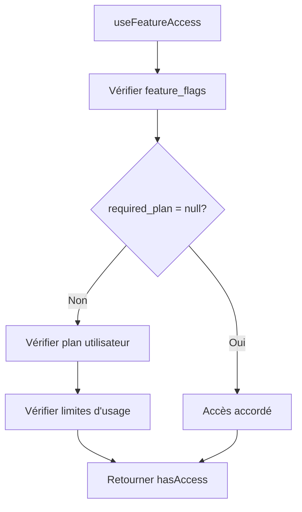

# Plan de Refactoring de l'UI de Paiement et Gating (Version Complète)

## 1. Objectif

Ce document détaille le plan d'action pour refactoriser l'interface utilisateur (UI) liée à la monétisation. L'objectif est de **consolider les composants**, **clarifier le parcours utilisateur**, **harmoniser l'expérience de "gating"** et **optimiser le taux de conversion** en présentant nos offres de manière cohérente et attrayante.

## 2. Principes Directeurs

1.  **Un seul Paywall :** Un composant `Paywall.tsx` modulaire.
2.  **Un seul Gating Lock :** Un composant `FeatureLock.tsx` générique.
3.  **Système de Feature Flags :** Une table `feature_flags` centralisée pour gérer les accès.
4.  **Hook unifié :** Un hook `useFeatureAccess` pour vérifier les accès.
5.  **Clarté des Limites :** L'utilisateur sait toujours où il en est.
6.  **Conversion Contextuelle :** Proposer la bonne offre au bon moment.

---

## 3. Architecture du Système de Gating

### 3.1. Table `feature_flags` (Base de Données)

Cette table centralise la configuration de toutes les fonctionnalités de l'application.

```sql
-- Structure de la table feature_flags
CREATE TABLE feature_flags (
  id TEXT PRIMARY KEY,
  name TEXT NOT NULL,
  description TEXT,
  required_plan TEXT REFERENCES subscription_plans(id),
  is_active BOOLEAN DEFAULT true,
  created_at TIMESTAMPTZ DEFAULT NOW()
);
```

**Configuration actuelle des fonctionnalités :**

| ID                   | Nom                          | Description                                         | Plan Requis   | Statut   |
| -------------------- | ---------------------------- | --------------------------------------------------- | ------------- | -------- |
| `account_analysis`   | Analyse de Compte            | Analyse approfondie de votre compte TikTok          | `null` (tous) | ✅ Actif |
| `chat_ai`            | Chat IA Éditorial            | Chat avec l'IA pour conseils éditoriaux             | `free` (tous) | ✅ Actif |
| `script_generation`  | Génération de Scripts        | Générer des scripts personnalisés avec IA           | `creator`     | ✅ Actif |
| `video_generation`   | Génération de Vidéos         | Générer des vidéos automatiquement avec IA          | `creator`     | ✅ Actif |
| `source_videos`      | Upload de Vidéos Sources     | Uploader des vidéos B-roll pour vos créations       | `creator`     | ✅ Actif |
| `advanced_subtitles` | Sous-titres Avancés          | Styles de sous-titres personnalisés                 | `creator`     | ✅ Actif |
| `voice_clone`        | Clonage Vocal                | Créer un clone de votre voix pour la narration      | `pro`         | ✅ Actif |
| `multiple_voices`    | Voix Multiples               | Gérer plusieurs voix clonées                        | `pro`         | ✅ Actif |
| `niche_analysis`     | Analyse de Niche/Compétition | Analyses concurrentielles et rapports hebdomadaires | `pro`         | ✅ Actif |
| `content_ideas`      | Idées de Contenu Proactives  | Notifications de tendances et suggestions           | `pro`         | ✅ Actif |
| `scheduling`         | Programmation de Contenu     | Connecter et programmer sur TikTok/YouTube          | `pro`         | ✅ Actif |

### 3.2. Hook `useFeatureAccess` (Logique Métier)

Ce hook centralise toute la logique de vérification d'accès aux fonctionnalités.

```typescript
// components/hooks/useFeatureAccess.ts

export function useFeatureAccess(featureId: string): {
  hasAccess: boolean;
  isLoading: boolean;
  remainingUsage: number;
  totalLimit: number;
  currentPlan: string;
};
```

**Logique de vérification :**

1. **Vérification du plan requis** : Consulte la table `feature_flags`
2. **Vérification des limites d'utilisation** : Consulte la table `user_usage`
3. **Gestion des cas spéciaux** : `required_plan = null` = accès automatique
4. **Fallback en cas d'erreur** : Logique de sécurité basée sur le plan actuel

**Exemple d'utilisation :**

```typescript
const { hasAccess, isLoading, remainingUsage } =
  useFeatureAccess('video_generation');

if (isLoading) return <LoadingSpinner />;
if (!hasAccess) return <FeatureLock requiredPlan="creator" />;
return <VideoGenerationComponent />;
```

### 3.3. Composant `FeatureLock` (UI de Gating)

Ce composant affiche l'interface de gating quand l'utilisateur n'a pas accès.

```typescript
// components/guards/FeatureLock.tsx

interface FeatureLockProps {
  children: React.ReactNode;
  requiredPlan: RequiredPlan;
  onLockPress?: () => void;
}

export const FeatureLock = ({
  children,
  requiredPlan,
  onLockPress,
}: FeatureLockProps) => {
  const { currentPlan } = useRevenueCat();

  // Logique de vérification d'accès
  const hasAccess = checkPlanAccess(currentPlan, requiredPlan);

  if (hasAccess) return <>{children}</>;

  // Affichage du lock screen avec bouton de fermeture discret
  return (
    <View style={styles.container}>
      <TouchableOpacity
        style={styles.closeButton}
        onPress={() => router.back()}
      >
        <X size={20} color="#888" />
      </TouchableOpacity>
      {children}
    </View>
  );
};
```

---

## 4. Plan d'Action par Composant (Avec Exemples)

### 4.1. Consolidation du Paywall (`Paywall.tsx`)

Ce composant devient le point d'entrée unique pour tous les abonnements.

**Logique Clé :**

- Il récupère les offres de RevenueCat.
- Il affiche les 3 plans côte à côte.
- Il gère un état pour le sélecteur `mensuel/annuel`.

**Exemple de Structure (Pseudo-code JSX) :**

```tsx
// components/Paywall.tsx

const Paywall = ({ visible, onClose }) => {
  const { currentOffering } = useRevenueCat();
  const [billingPeriod, setBillingPeriod] = useState<'monthly' | 'annually'>('monthly');

  const plansData = [
    { id: 'free', title: 'Découverte', price: 'Gratuit', features: [...] },
    { id: 'creator', title: 'Créateur', isFeatured: true, features: [...] },
    { id: 'pro', title: 'Pro', features: [...] }
  ];

  const handlePurchase = (pkg: PurchasesPackage) => { /* ... */ };

  return (
    <Modal>
      {/* ... Header avec bouton de fermeture ... */}
      <BillingToggle selected={billingPeriod} onSelect={setBillingPeriod} />

      <View style={styles.plansContainer}>
        {plansData.map(plan => {
          // Trouve le bon package (mensuel/annuel) dans l'offre de RevenueCat
          const rcPackage = findPackageForPlan(currentOffering, plan.id, billingPeriod);

          return (
            <PlanCard
              key={plan.id}
              plan={plan}
              rcPackage={rcPackage}
              onPress={() => handlePurchase(rcPackage)}
              isFeatured={plan.isFeatured}
            />
          );
        })}
      </View>
    </Modal>
  );
};
```

### 4.2. Refactoring du Gating (`FeatureLock.tsx`)

Ce composant devient un "wrapper" qui bloque l'accès à une fonctionnalité.

**Logique Clé :**

- Il compare le plan requis avec le plan actuel de l'utilisateur.
- Il peut soit cacher complètement son contenu (`children`), soit l'afficher de manière désactivée.

**Exemple d'Implémentation :**

```tsx
// components/guards/FeatureLock.tsx

import { useRevenueCat } from '@/contexts/providers/RevenueCat';

type RequiredPlan = 'creator' | 'pro';
const planOrder: RequiredPlan[] = ['creator', 'pro'];

interface FeatureLockProps {
  children: React.ReactNode;
  requiredPlan: RequiredPlan;
  onLockPress?: () => void; // Pour afficher le paywall
}

export const FeatureLock = ({
  children,
  requiredPlan,
  onLockPress,
}: FeatureLockProps) => {
  const { currentPlan } = useRevenueCat(); // 'free', 'creator', 'pro'

  const currentUserLevel = planOrder.indexOf(currentPlan as any); // -1 si 'free'
  const requiredLevel = planOrder.indexOf(requiredPlan);

  const hasAccess = currentUserLevel >= requiredLevel;

  if (hasAccess) {
    return <>{children}</>;
  }

  // Affichage du lock screen avec bouton de fermeture discret
  return (
    <View style={styles.container}>
      <TouchableOpacity
        style={styles.closeButton}
        onPress={() => router.back()}
      >
        <X size={20} color="#888" />
      </TouchableOpacity>
      {children}
    </View>
  );
};
```

**Exemple d'Utilisation :**

```tsx
// Dans la page de gestion des voix
<FeatureLock requiredPlan="pro" onLockPress={presentPaywall}>
  <Button title="Ajouter une deuxième voix" onPress={addSecondVoice} />
</FeatureLock>
```

### 4.3. Mise à jour du `SubscriptionManager.tsx`

**Logique Clé :**

- Afficher l'état actuel et les compteurs.
- Proposer l'action d'upgrade la plus pertinente.

**Exemple de Logique de Rendu :**

```tsx
// components/SubscriptionManager.tsx

const SubscriptionManager = () => {
  const { currentPlan, videosRemaining, analysesRemaining, presentPaywall } =
    useRevenueCat();

  const renderContent = () => {
    switch (currentPlan) {
      case 'pro':
        return <Text>Vous êtes un membre Pro. Merci !</Text>;

      case 'creator':
        return (
          <>
            <Text>Plan Créateur: {videosRemaining} vidéos restantes.</Text>
            <Button
              title="Passer Pro pour l'illimité"
              onPress={presentPaywall}
            />
          </>
        );

      case 'free':
      default:
        return (
          <>
            <Text>Plan Découverte: {analysesRemaining} analyse restante.</Text>
            <Button
              title="Débloquer 15 vidéos/mois avec le plan Créateur"
              onPress={presentPaywall}
            />
          </>
        );
    }
  };

  return <View>{renderContent()}</View>;
};
```

---

## 5. Stratégies de Conversion Contextuelles (80/20)

L'objectif est de présenter l'offre au moment précis où l'utilisateur en ressent le besoin ou la valeur.

| Lieu dans l'App              | Déclencheur (Trigger)                                       | Stratégie de Conversion Suggérée                                                                                                                  | Plan Ciblé          |
| :--------------------------- | :---------------------------------------------------------- | :------------------------------------------------------------------------------------------------------------------------------------------------ | :------------------ |
| **Liste des Vidéos Sources** | L'utilisateur a uploadé 4 ou 5 vidéos.                      | Afficher un bandeau non-bloquant : "Vous approchez de la limite. Passez au plan **Créateur** pour uploader jusqu'à 50 vidéos."                    | `Créateur`          |
| **Après Génération Vidéo**   | L'utilisateur vient de générer une vidéo avec succès.       | Afficher un toast/modal de succès : "Vidéo générée ! 🎉 Saviez-vous que le plan **Créateur** vous en offre 15 chaque mois ?"                      | `Créateur`          |
| **Page d'Analyse de Compte** | L'utilisateur consulte son analyse (plan Découverte).       | Ajouter un encart : "Cette analyse vous a plu ? Obtenez des rapports frais chaque semaine et suivez votre progression avec le plan **Créateur**." | `Créateur`          |
| **Page de Script/Chat**      | L'utilisateur est sur le plan Créateur.                     | Intégrer un petit "hint" dans l'interface : "💡 Envie d'analyser la concurrence pour inspirer vos scripts ? C'est possible avec le plan **Pro**." | `Pro`               |
| **Écran des Paramètres**     | L'utilisateur est sur le plan Créateur et a 1 voix.         | À côté de sa voix clonée, afficher un bouton désactivé : "Ajouter une 2ème voix (Plan Pro)". Au clic, ouvrir le paywall.                          | `Pro`               |
| **Partout**                  | L'utilisateur atteint une limite stricte (ex: 16ème vidéo). | Utiliser le composant `<FeatureLock />` pour bloquer l'action et afficher le paywall au clic.                                                     | `Créateur` ou `Pro` |

---

## 6. Implémentation Technique

### 6.1. Hiérarchie des Guards

**Niveau 1 - Layout Guards :**

- `AccountAnalysisGuard` : Vérifie qu'une analyse existe avant d'accéder aux écrans d'analyse
- Utilise `useFeatureAccess('account_analysis')` pour vérifier l'accès

**Niveau 2 - Feature Guards :**

- `FeatureLock` : Gating spécifique par fonctionnalité
- Utilise `useFeatureAccess(featureId)` pour vérifier l'accès

**Niveau 3 - Usage Guards :**

- Vérification des limites d'utilisation dans `useFeatureAccess`
- Affichage des compteurs restants

### 6.2. Flux de Vérification d'Accès



### 6.3. Gestion des Erreurs

- **Erreur de base de données** : Fallback sur le plan actuel
- **Feature flag manquant** : Accès refusé par défaut
- **Usage record manquant** : Création automatique avec limites du plan gratuit

Ce plan d'action détaillé fournit une base solide pour une implémentation cohérente et axée sur la conversion.
