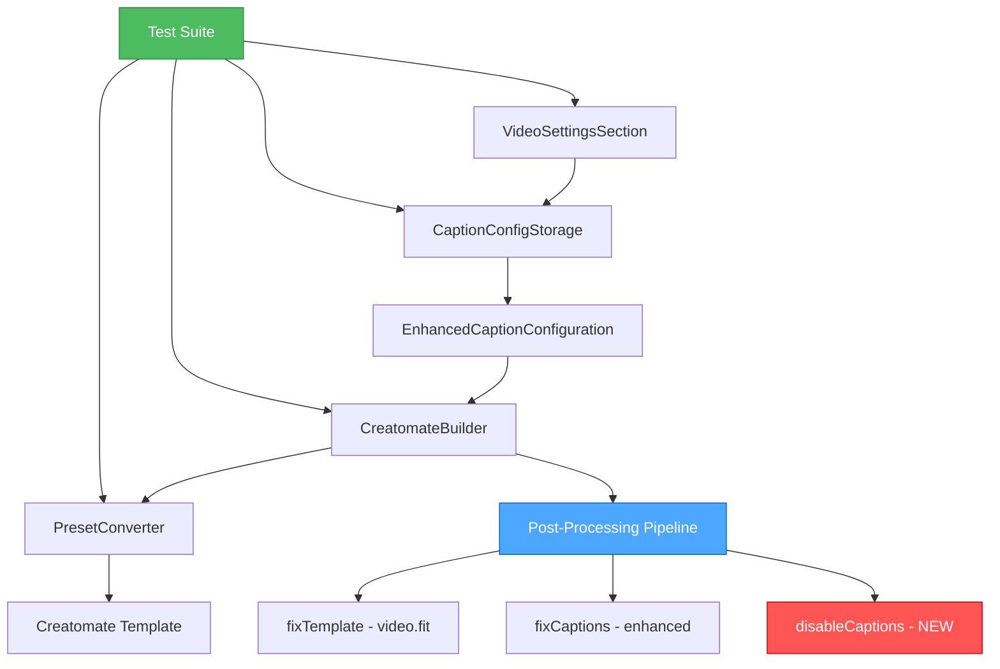
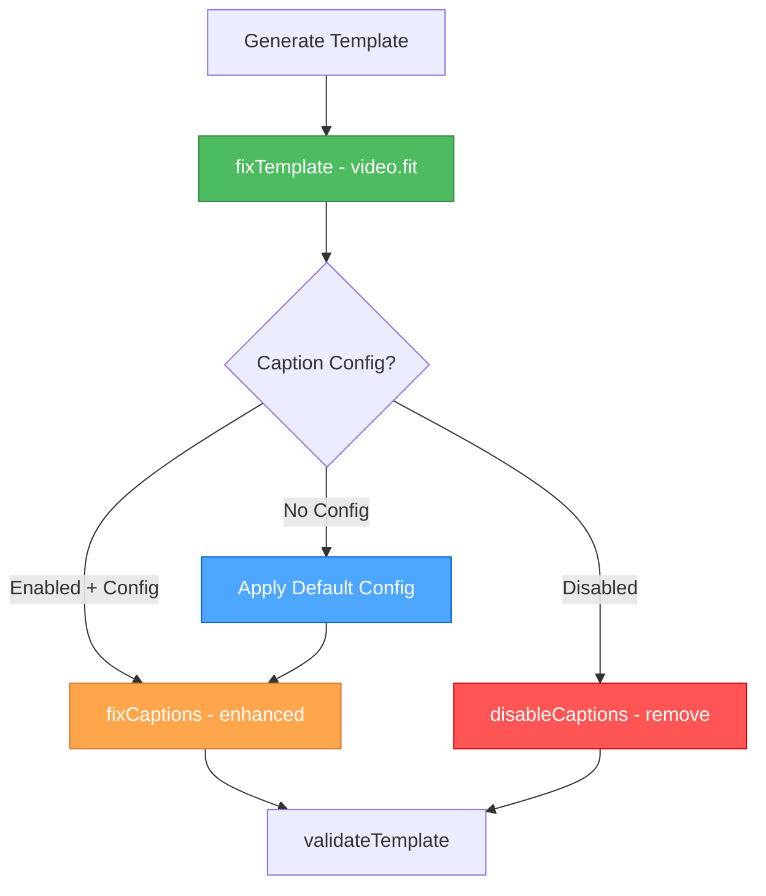
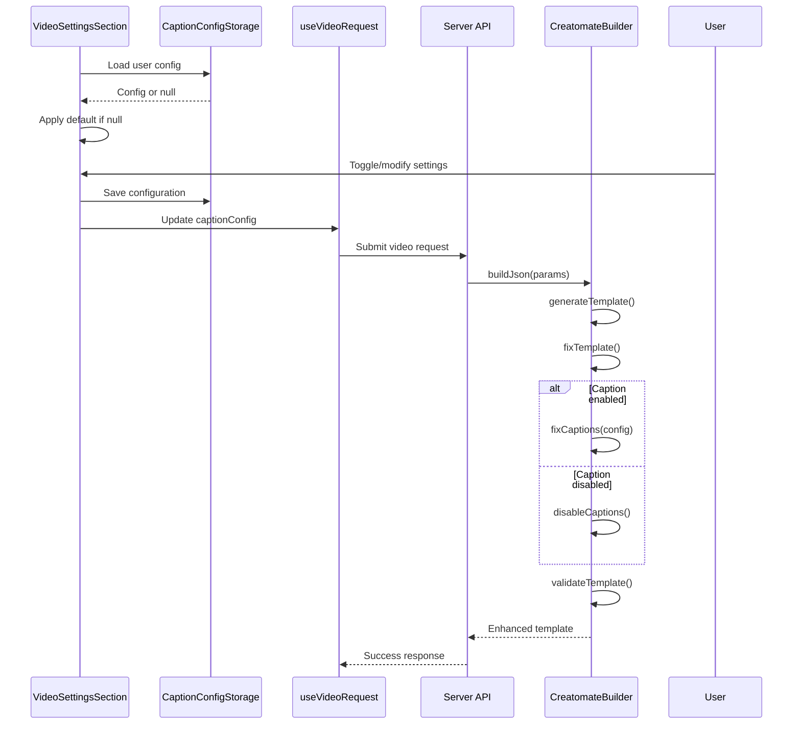

# Creative Phase: Enhanced Caption System Architecture Design

## 1. CONTEXT & REQUIREMENTS

### System Requirements

- **Default Configuration**: System must work without user setup
- **Caption Toggle**: Ability to completely disable caption generation
- **Enhanced Controls**: Support custom colors, effects, and positioning
- **Backward Compatibility**: Existing caption configs must continue working
- **Post-Processing Integration**: Leverage existing fixCaptions workflow
- **Test Coverage**: Maintain TDD approach with comprehensive test suite

### Technical Constraints

- **Existing Pipeline**: Must preserve current video.fit fixing in creatomateBuilder.ts
- **Type Safety**: Strong TypeScript typing throughout
- **Storage**: Device-local storage using existing CaptionConfigStorage
- **UI Framework**: React Native with existing component patterns
- **Testing**: Jest with existing test infrastructure

## 2. COMPONENT ANALYSIS

### Core Components

**Frontend Components:**

- **VideoSettingsSection.tsx**: Enhanced UI with toggle and advanced controls
- **types/video.ts**: Expanded CaptionConfiguration interface
- **lib/utils/caption-config-storage.ts**: Enhanced storage with defaults
- **lib/config/video-presets.ts**: Extended preset definitions

**Backend Components:**

- **server/src/services/creatomateBuilder.ts**: Enhanced post-processing pipeline
- **server/src/utils/video/preset-converter.ts**: Extended property conversion
- ****tests**/**: Comprehensive test coverage for new functionality

### Component Interactions



## 3. ARCHITECTURE OPTIONS

### Option 1: Single Post-Processing Pipeline (SELECTED)

**Description**: Extend existing post-processing architecture with new caption disable step

**Architecture:**



**Pros:**

- ✅ Maintains existing successful pattern
- ✅ Clear separation of concerns
- ✅ Easy to test individual steps
- ✅ Preserves video.fit fix integrity
- ✅ Minimal disruption to existing code

**Cons:**

- ❌ Sequential processing (but acceptable for this use case)

**Technical Fit**: High
**Complexity**: Medium
**Scalability**: High

### Option 2: Parallel Processing Architecture

**Description**: Process caption config and video.fit fixes in parallel

**Pros:**

- ✅ Potentially faster processing
- ✅ Independent processing paths

**Cons:**

- ❌ More complex coordination logic
- ❌ Risk of processing conflicts
- ❌ Harder to test and debug
- ❌ Unnecessary complexity for this use case

**Technical Fit**: Medium
**Complexity**: High
**Scalability**: Medium

### Option 3: Event-Driven Architecture

**Description**: Use events to trigger processing steps

**Pros:**

- ✅ Highly decoupled
- ✅ Extensible for future features

**Cons:**

- ❌ Over-engineering for current requirements
- ❌ Complex debugging and testing
- ❌ Performance overhead

**Technical Fit**: Low
**Complexity**: High
**Scalability**: High

## 4. DECISION

**Chosen Option**: Option 1 - Single Post-Processing Pipeline

**Rationale**:

- Follows proven patterns from video.fit and caption fixes
- Maintains simplicity while adding required functionality
- Easy to test with existing TDD approach
- Clear flow for default configuration handling
- Minimal risk to existing functionality

## 5. DETAILED ARCHITECTURE DESIGN

### Enhanced Type System

```typescript
// Extended CaptionConfiguration
interface EnhancedCaptionConfiguration {
  enabled: boolean; // NEW: Toggle control
  presetId?: string; // Existing
  placement: 'top' | 'center' | 'bottom'; // Existing (renamed from middle)
  transcriptColor?: string; // NEW: Custom color override
  transcriptEffect?: TranscriptEffect; // NEW: Effect override
}

type TranscriptEffect =
  | 'karaoke'
  | 'highlight'
  | 'fade'
  | 'bounce'
  | 'slide'
  | 'enlarge';

// Default configuration
const DEFAULT_CAPTION_CONFIG: EnhancedCaptionConfiguration = {
  enabled: true,
  presetId: 'karaoke',
  placement: 'bottom',
  transcriptColor: '#04f827',
  transcriptEffect: 'karaoke',
};
```

### Post-Processing Pipeline Enhancement

```typescript
class CreatomateBuilder {
  async buildJson(params: BuildParams): Promise<any> {
    // 1. Generate template (existing)
    const template = await this.generateTemplate(params);

    // 2. Fix video.fit issues (existing)
    this.fixTemplate(template);

    // 3. Handle caption configuration (enhanced)
    const captionConfig = params.captionStructure || DEFAULT_CAPTION_CONFIG;

    if (captionConfig.enabled) {
      // Apply caption configuration
      this.fixCaptions(template, captionConfig);
    } else {
      // Remove all caption elements
      this.disableCaptions(template);
    }

    // 4. Validate template (existing)
    this.validateTemplate(template);

    return template;
  }

  // NEW: Caption disabling functionality
  private disableCaptions(template: any) {
    template.elements.forEach((scene: any) => {
      scene.elements = scene.elements.filter((element: any) => {
        return !(
          element.type === 'text' &&
          element.name &&
          element.name.toLowerCase().includes('subtitle')
        );
      });
    });
  }

  // ENHANCED: Support new configuration properties
  private fixCaptions(
    template: any,
    captionConfig: EnhancedCaptionConfiguration
  ) {
    const captionProperties = this.convertConfigToProperties(captionConfig);

    template.elements.forEach((scene: any) => {
      scene.elements.forEach((element: any) => {
        if (
          element.type === 'text' &&
          element.name &&
          element.name.toLowerCase().includes('subtitle')
        ) {
          // Preserve critical properties
          const preservedProperties = {
            id: element.id,
            name: element.name,
            type: element.type,
            track: element.track,
            time: element.time,
            duration: element.duration,
            transcript_source: element.transcript_source,
          };

          // Apply configuration, then restore preserved properties
          Object.assign(element, captionProperties, preservedProperties);
        }
      });
    });
  }
}
```

### Default Configuration Strategy

```typescript
class CaptionConfigStorage {
  static async load(
    userId: string
  ): Promise<EnhancedCaptionConfiguration | null> {
    try {
      const stored = await AsyncStorage.getItem(`caption_config_${userId}`);
      return stored ? JSON.parse(stored) : null;
    } catch (error) {
      console.error('Error loading caption config:', error);
      return null;
    }
  }

  static getDefault(): EnhancedCaptionConfiguration {
    return DEFAULT_CAPTION_CONFIG;
  }

  // NEW: Smart default that ensures captions work without setup
  static async getOrDefault(
    userId: string
  ): Promise<EnhancedCaptionConfiguration> {
    const stored = await this.load(userId);
    return stored || this.getDefault();
  }
}
```

### Enhanced Preset System

```typescript
// Extended video presets with all transcript effects
const VIDEO_PRESETS = [
  {
    id: 'karaoke',
    name: 'Karaoke',
    // ... existing properties
    transcript_effect: 'karaoke',
    transcript_color: '#04f827',
  },
  {
    id: 'beasty',
    name: 'Beasty',
    // ... existing properties
    transcript_effect: 'highlight',
    transcript_color: '#FFFD03',
  },
  // NEW: Additional effect presets
  {
    id: 'fade',
    name: 'Fade',
    transcript_effect: 'fade',
    transcript_color: '#ffffff',
  },
  {
    id: 'bounce',
    name: 'Bounce',
    transcript_effect: 'bounce',
    transcript_color: '#ff4081',
  },
  // ... additional presets
];
```

## 6. DATA FLOW ARCHITECTURE



## 7. TESTING ARCHITECTURE

### Test Strategy

```typescript
describe('Enhanced Caption System', () => {
  describe('Default Configuration', () => {
    test('should apply default config when none provided');
    test('should not require user setup for basic functionality');
  });

  describe('Caption Toggle', () => {
    test('should remove all subtitle elements when disabled');
    test('should preserve video and audio elements when disabled');
    test('should apply configuration when enabled');
  });

  describe('Enhanced Controls', () => {
    test('should override preset color with custom color');
    test('should override preset effect with custom effect');
    test('should support all transcript effects');
  });

  describe('Backward Compatibility', () => {
    test('should work with existing caption configurations');
    test('should migrate old configs to new format gracefully');
  });
});
```

### Test Coverage Targets

- **Unit Tests**: 100% coverage for new methods
- **Integration Tests**: Complete post-processing pipeline
- **UI Tests**: Component behavior with various configurations
- **End-to-End Tests**: Full video generation with captions

## 8. IMPLEMENTATION CONSIDERATIONS

### Migration Strategy

```typescript
// Graceful migration for existing configurations
function migrateConfig(oldConfig: any): EnhancedCaptionConfiguration {
  return {
    enabled: true, // Default enabled for existing users
    presetId: oldConfig.presetId,
    placement:
      oldConfig.placement === 'middle' ? 'center' : oldConfig.placement,
    transcriptColor: oldConfig.highlightColor, // Rename property
    transcriptEffect: oldConfig.transcriptEffect || 'karaoke', // Default effect
  };
}
```

### Error Handling

- **Graceful Degradation**: Invalid configs fall back to defaults
- **Validation**: Type checking at storage and processing boundaries
- **Logging**: Comprehensive error tracking for debugging

### Performance Considerations

- **Lazy Loading**: Color picker component loaded on demand
- **Memoization**: Cache preset conversion results
- **Minimal Re-renders**: Optimized React state updates

## 9. SECURITY & VALIDATION

### Input Validation

```typescript
function validateCaptionConfig(config: any): EnhancedCaptionConfiguration {
  return {
    enabled: Boolean(config?.enabled ?? true),
    presetId:
      typeof config?.presetId === 'string' ? config.presetId : 'karaoke',
    placement: ['top', 'center', 'bottom'].includes(config?.placement)
      ? config.placement
      : 'bottom',
    transcriptColor: isValidHexColor(config?.transcriptColor)
      ? config.transcriptColor
      : '#04f827',
    transcriptEffect: VALID_EFFECTS.includes(config?.transcriptEffect)
      ? config.transcriptEffect
      : 'karaoke',
  };
}
```

## 10. DEPLOYMENT & MONITORING

### Rollout Strategy

1. **Phase 1**: Backend post-processing enhancements
2. **Phase 2**: Frontend UI components
3. **Phase 3**: Default configuration integration
4. **Phase 4**: Advanced controls rollout

### Monitoring

- **Error Tracking**: Caption processing failures
- **Usage Analytics**: Feature adoption rates
- **Performance Metrics**: Template processing time

## STATUS: ✅ COMPLETED - Architecture Design Phase

**Decision Summary**: Single post-processing pipeline with enhanced caption configuration, default handling, and caption disable functionality.

**Next Phase**: IMPLEMENT - Build the enhanced caption system following the designed architecture.

## VALIDATION

### Requirements Met

- ✅ Default configuration system designed
- ✅ Caption toggle architecture defined
- ✅ Enhanced controls integration planned
- ✅ Backward compatibility ensured
- ✅ Post-processing pipeline enhanced
- ✅ Test strategy comprehensive

### Technical Feasibility: HIGH

- Builds on proven patterns
- Low risk architectural changes
- Clear implementation path

### Risk Assessment: LOW

- Minimal disruption to existing functionality
- Comprehensive testing strategy
- Graceful fallback mechanisms
