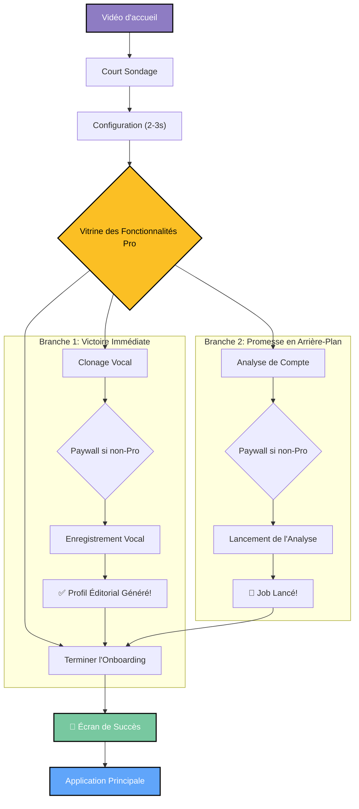

# Stratégie d'Onboarding : La Victoire Immédiate et la Promesse en Arrière-Plan

## 1. Objectif

Simplifier radicalement le parcours d'onboarding pour augmenter la conversion en :

- Réduisant la friction et les points d'abandon.
- Démontrant la valeur des fonctionnalités Pro de manière tangible et rapide.
- Éliminant les temps d'attente bloquants.

## 2. Le Nouveau Parcours Simplifié

Le flux de l'utilisateur sera linéaire et focalisé sur l'action.

## 3. Principes Clés de l'Implémentation

1.  **Suppression des Écrans de Paiement Redondants**:

    - Les fichiers `subscription.tsx` et `trial-offer.tsx` ne seront plus utilisés dans ce flux.
    - Le paiement est demandé contextuellement via le composant `ProFeatureLock` directement sur les écrans des fonctionnalités (`voice-clone`, `tiktok-analysis`).

2.  **Gestion de l'État `isPro`**:

    - Chaque écran "verrouillé" vérifiera l'état `isPro` de l'utilisateur via le hook `useFeatureAccess`. Si l'utilisateur s'abonne, les écrans suivants s'adapteront automatiquement.

3.  **Analyse de Compte Asynchrone**:

    - L'écran `tiktok-analysis.tsx` ne bloquera plus l'utilisateur.
    - Il lancera le job d'analyse en arrière-plan et utilisera une notification "toast" pour informer l'utilisateur, avant de le laisser continuer.

4.  **Valeur Immédiate du Clonage Vocal**:

    - Après l'enregistrement vocal, l'utilisateur verra immédiatement son profil éditorial. C'est un "Aha! moment" qui démontre la puissance de l'IA.

5.  **Simplification des Écrans Superflus**:
    - L'écran `processing.tsx` deviendra un simple indicateur de "configuration" rapide et authentique, basé sur les réponses au sondage.

## 4. Plan d'Action Technique

1.  **Analyser et restructurer `_layout.tsx`** pour refléter le nouveau flux linéaire.
2.  **Modifier `features.tsx`** pour qu'il devienne la plaque tournante vers les fonctionnalités Pro.
3.  **Intégrer `ProFeatureLock`** dans `voice-clone.tsx` et `tiktok-analysis.tsx`.
4.  **Modifier la logique de `tiktok-analysis.tsx`** pour un lancement asynchrone.
5.  **Assurer la navigation** `voice-recording` -> `editorial-profile`.
6.  **Supprimer/archiver** les écrans devenus obsolètes.
